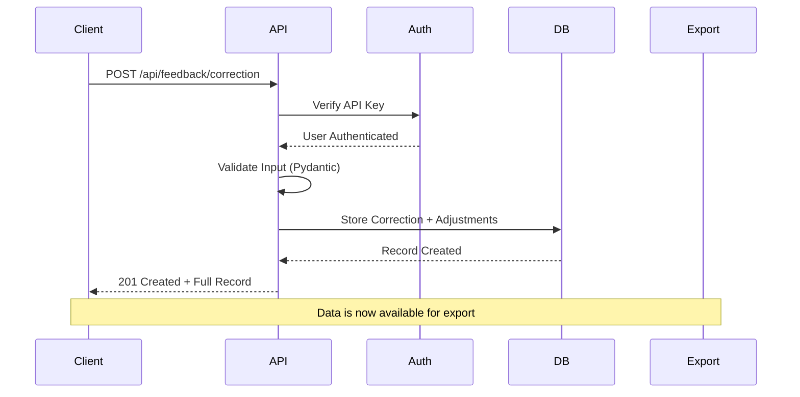
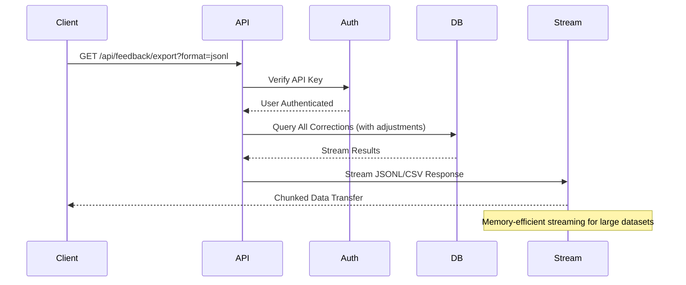
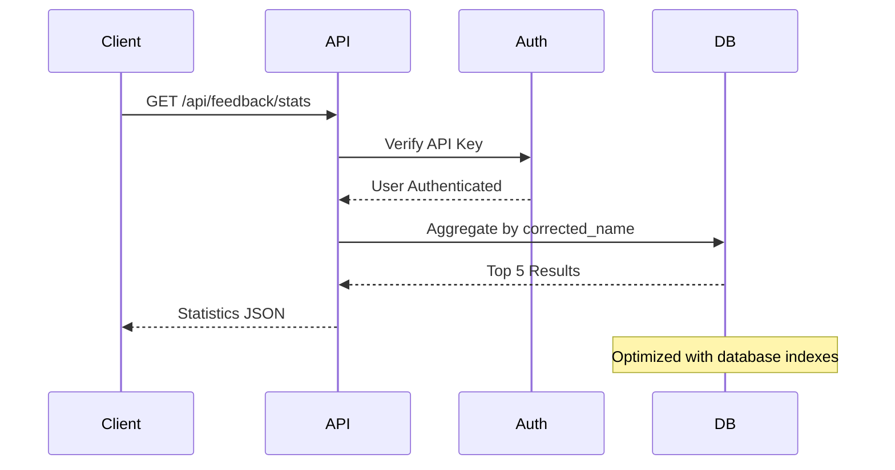

# Architecture & Working Flow

## System Overview

The WowNom Feedback Collector is a production-ready FastAPI backend that collects user corrections for food detection/classification systems. It provides structured data storage, streaming exports, and analytics for retraining ML models.

## Architecture Diagram

```
┌─────────────────────────────────────────────────────────────────┐
│                        Client Applications                      │
│  ┌─────────────┐  ┌─────────────┐  ┌─────────────┐            │
│  │   Web App   │  │  Mobile App │  │   Admin UI  │            │
│  └─────────────┘  └─────────────┘  └─────────────┘            │
└─────────────────────┬───────────────────────────────────────────┘
                      │ HTTPS/JSON
                      ▼
┌─────────────────────────────────────────────────────────────────┐
│                    FastAPI Application                         │
│  ┌─────────────────────────────────────────────────────────┐   │
│  │                Security Layer                           │   │
│  │  • API Key Authentication                              │   │
│  │  • CORS Protection                                     │   │
│  │  • Input Validation (Pydantic)                        │   │
│  └─────────────────────────────────────────────────────────┘   │
│  ┌─────────────────────────────────────────────────────────┐   │
│  │                Business Logic                           │   │
│  │  • Feedback Collection                                 │   │
│  │  • Data Export (JSONL/CSV)                            │   │
│  │  • Statistics & Analytics                             │   │
│  └─────────────────────────────────────────────────────────┘   │
└─────────────────────┬───────────────────────────────────────────┘
                      │ SQLAlchemy ORM
                      ▼
┌─────────────────────────────────────────────────────────────────┐
│                      Database Layer                            │
│  ┌─────────────────────────────────────────────────────────┐   │
│  │                SQLite/PostgreSQL                       │   │
│  │  • feedback_corrections (main records)                 │   │
│  │  • ingredient_adjustments (structured data)            │   │
│  │  • dish_taxonomy (canonical names & aliases)           │   │
│  └─────────────────────────────────────────────────────────┘   │
└─────────────────────────────────────────────────────────────────┘
```

## Data Flow

### 1. Feedback Collection Flow



### 2. Export Flow



### 3. Statistics Flow



## Database Schema

### Tables

#### `feedback_corrections`
```sql
CREATE TABLE feedback_corrections (
    id INTEGER PRIMARY KEY,
    image_id VARCHAR(200) NOT NULL,
    original_name VARCHAR(200) NOT NULL,
    original_grams INTEGER NOT NULL,
    corrected_name VARCHAR(200) NOT NULL,
    corrected_grams INTEGER NOT NULL,
    created_at DATETIME NOT NULL DEFAULT CURRENT_TIMESTAMP
);

CREATE INDEX idx_feedback_image_id ON feedback_corrections(image_id);
CREATE INDEX idx_feedback_corrected_name ON feedback_corrections(corrected_name);
CREATE INDEX idx_feedback_created_at ON feedback_corrections(created_at);
```

#### `ingredient_adjustments`
```sql
CREATE TABLE ingredient_adjustments (
    id INTEGER PRIMARY KEY,
    correction_id INTEGER NOT NULL,
    ingredient VARCHAR(100) NOT NULL,
    delta_grams INTEGER NOT NULL,
    notes TEXT,
    FOREIGN KEY (correction_id) REFERENCES feedback_corrections(id)
);

CREATE INDEX idx_adj_correction_id ON ingredient_adjustments(correction_id);
CREATE INDEX idx_adj_correction_ingredient ON ingredient_adjustments(correction_id, ingredient);
```

#### `dish_taxonomy`
```sql
CREATE TABLE dish_taxonomy (
    id VARCHAR(50) PRIMARY KEY,
    name VARCHAR(200) NOT NULL UNIQUE,
    aliases JSON NOT NULL,
    ingredients JSON NOT NULL,
    macros_per_100g JSON NOT NULL,
    is_active INTEGER DEFAULT 1,
    created_at DATETIME NOT NULL DEFAULT CURRENT_TIMESTAMP,
    updated_at DATETIME NOT NULL DEFAULT CURRENT_TIMESTAMP
);

CREATE INDEX idx_taxonomy_name ON dish_taxonomy(name);
CREATE INDEX idx_taxonomy_active ON dish_taxonomy(is_active);
```

## API Endpoints

### Authentication
All endpoints (except health checks) require API key authentication:
```bash
Authorization: Bearer demo-key-123
```

### Core Endpoints

| Method | Endpoint | Description | Auth Required |
|--------|----------|-------------|---------------|
| `GET` | `/healthz` | Health check | No |
| `GET` | `/api/feedback/health` | Health check | No |
| `POST` | `/api/feedback/correction` | Submit correction | Yes |
| `GET` | `/api/feedback/export` | Export data | Yes |
| `GET` | `/api/feedback/stats` | Get statistics | Yes |

### Request/Response Examples

#### Submit Correction
```bash
curl -X POST http://localhost:8000/api/feedback/correction \
  -H "Authorization: Bearer demo-key-123" \
  -H "Content-Type: application/json" \
  -d '{
    "imageId": "img_12345",
    "original": {"name": "Fried Rice", "grams": 250},
    "corrected": {"name": "Tonkotsu Ramen", "grams": 420},
    "adjustments": [
      {"ingredient": "Egg", "deltaGrams": -20, "notes": "Less egg"},
      {"ingredient": "Noodles", "deltaGrams": 50, "notes": "More noodles"}
    ]
  }'
```

**Response:**
```json
{
  "id": 1,
  "imageId": "img_12345",
  "original": {"name": "Fried Rice", "grams": 250},
  "corrected": {"name": "Tonkotsu Ramen", "grams": 420},
  "adjustments": [
    {"ingredient": "Egg", "deltaGrams": -20, "notes": "Less egg"},
    {"ingredient": "Noodles", "deltaGrams": 50, "notes": "More noodles"}
  ],
  "createdAt": "2025-09-26T15:46:47.876837Z"
}
```

#### Export Data
```bash
# JSONL format
curl -H "Authorization: Bearer demo-key-123" \
  http://localhost:8000/api/feedback/export?format=jsonl

# CSV format
curl -H "Authorization: Bearer demo-key-123" \
  http://localhost:8000/api/feedback/export?format=csv
```

#### Get Statistics
```bash
curl -H "Authorization: Bearer demo-key-123" \
  http://localhost:8000/api/feedback/stats
```

**Response:**
```json
{
  "top5": [
    {"label": "Tonkotsu Ramen", "count": 12},
    {"label": "Fried Rice", "count": 8},
    {"label": "Caesar Salad", "count": 5}
  ]
}
```

## Security Features

### Authentication
- **API Key-based**: Simple key-value authentication
- **JWT Support**: Ready for token-based auth
- **Per-endpoint protection**: All data endpoints require auth

### Input Validation
- **Pydantic schemas**: Strict type checking and validation
- **Field constraints**: Length limits, numeric ranges
- **Extra field rejection**: Prevents injection via unknown fields

### Database Security
- **SQLAlchemy ORM**: Prevents SQL injection
- **Parameterized queries**: All database operations use parameters
- **Connection pooling**: Secure connection management

### CORS Protection
- **Configurable origins**: Set via `ALLOWED_ORIGINS` environment variable
- **Method restrictions**: Only GET/POST allowed
- **Header controls**: Configurable allowed headers

## Performance Features

### Streaming Exports
- **Memory efficient**: Streams large datasets without loading into memory
- **Chunked transfer**: Supports large export files
- **Multiple formats**: JSONL and CSV streaming

### Database Optimization
- **Indexes**: Optimized for common query patterns
- **Connection pooling**: Efficient database connections
- **Query optimization**: Eager loading for related data

### Error Handling
- **Graceful degradation**: Proper error responses
- **Transaction safety**: Rollback on errors
- **Timeout protection**: Prevents hanging requests

## Deployment Architecture

### Development
```bash
# Local development
python3 -m venv .venv
source .venv/bin/activate
pip install -r requirements.txt
uvicorn app.main:app --reload
```

### Production
```bash
# Environment setup
export DATABASE_URL="postgresql://user:pass@db:5432/feedback"
export SECRET_KEY="$(openssl rand -hex 32)"
export ALLOWED_ORIGINS="https://yourdomain.com"

# Run migrations
alembic upgrade head

# Start server
uvicorn app.main:app --host 0.0.0.0 --port 8000
```

### Docker
```dockerfile
FROM python:3.11-slim
WORKDIR /app
COPY requirements.txt .
RUN pip install -r requirements.txt
COPY . .
RUN alembic upgrade head
EXPOSE 8000
CMD ["uvicorn", "app.main:app", "--host", "0.0.0.0", "--port", "8000"]
```

## Monitoring & Observability

### Health Checks
- **Liveness**: `GET /healthz` - Basic service health
- **Readiness**: `GET /api/feedback/health` - Detailed health status

### Logging
- **Structured logging**: JSON-formatted logs
- **Request tracking**: Unique request IDs
- **Error tracking**: Detailed error information

### Metrics
- **Request counts**: Per-endpoint metrics
- **Response times**: Performance monitoring
- **Error rates**: Failure tracking

## Testing Strategy

### Test Coverage
- **Unit tests**: Individual component testing
- **Integration tests**: End-to-end API testing
- **Security tests**: Authentication and validation testing
- **Performance tests**: Load and stress testing

### CI/CD Pipeline
- **Automated testing**: GitHub Actions workflow
- **Code quality**: Linting and formatting checks
- **Security scanning**: Bandit and Safety checks
- **Database testing**: Migration and schema validation

## Scalability Considerations

### Horizontal Scaling
- **Stateless design**: No server-side session storage
- **Database scaling**: Read replicas for export queries
- **Load balancing**: Multiple application instances

### Vertical Scaling
- **Memory optimization**: Streaming for large datasets
- **CPU optimization**: Async processing where possible
- **Database optimization**: Proper indexing and query optimization

### Data Management
- **Retention policies**: Configurable data retention
- **Archival**: Move old data to cold storage
- **Backup strategies**: Regular database backups

## Troubleshooting Guide

### Common Issues

#### Database Connection
```bash
# Check connection
python -c "from app.database import engine; print(engine.url)"

# Test connection
python -c "from app.database import get_db_session; db = get_db_session(); print('Connected')"
```

#### Migration Issues
```bash
# Check migration status
alembic current

# Apply migrations
alembic upgrade head

# Create new migration
alembic revision --autogenerate -m "Description"
```

#### Authentication Issues
```bash
# Test with valid key
curl -H "Authorization: Bearer demo-key-123" http://localhost:8000/api/feedback/health

# Test with invalid key
curl -H "Authorization: Bearer invalid-key" http://localhost:8000/api/feedback/health
```

### Performance Issues
- **Check database indexes**: Ensure proper indexing
- **Monitor memory usage**: Use streaming for large exports
- **Check connection pooling**: Adjust pool settings if needed

### Security Issues
- **Verify CORS settings**: Check allowed origins
- **Check API keys**: Ensure proper key management
- **Review logs**: Check for suspicious activity
